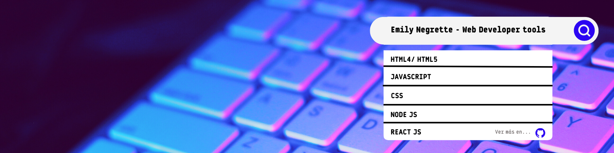
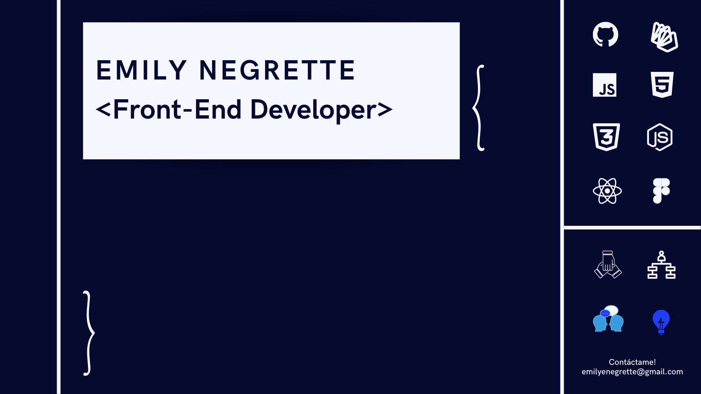

Hola!  Mi nombre es Emily Negrette.

Soy una Front-End Developer apasionada por el cambio. Desde pequeña siempre soñé con formar parte de un mundo donde la innovación y la creatividad me rodearan. Por eso, cuando conocí los videojuegos me encantaron. Para mí, representaban la materialización del mundo con el que soñaba y me permitía conectar con personas alrededor del mundo que compartían mi pasión. Por eso, cuando decidí estudiar programación, encontré un espacio de mi vida que me permitió seguir explorando un mundo desafiante que ahora me ayuda a crear plataformas, generar interacciones e innovar a tan solo un click de distancia.

En esta página podrás encontrar algunos de mis trabajos como Front-End Developer/Web Developer, desarrollando diversas tecnologías como HTML5, CSS3, JavaScript, NodeJs, React, Trello, Asana, Git, Github, Scrum, Firebase y muchas más, porque siempre estoy en constante aprendizaje y ansiando saber muchísimos más Frameworks y Herramientas. 

<!--
**emilyenegrette/emilyenegrette** is a ✨ _special_ ✨ repository because its `README.md` (this file) appears on your GitHub profile.

Here are some ideas to get you started:

- 🔭 I’m currently working on ...
- 🌱 I’m currently learning ...
- 👯 I’m looking to collaborate on ...
- 🤔 I’m looking for help with ...
- 💬 Ask me about ...
- 📫 How to reach me: ...
- 😄 Pronouns: ...
- ⚡ Fun fact: ...
-->
