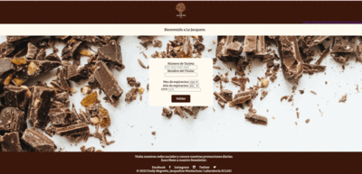

 
## Hello World! 👋   
### As a highly motivated and experienced Front-End Developer, I am excited to bring my skills and passion to your organization. With over a year of experience in the industry, I have honed my skills in HTML, CSS, JavaScript, Node.js, React.js, WordPress, WooCommerce, Firebase, Firestore, SQL, Mailfloss, Figma, Trello, Scrum, Git, and GitHub, and Asana. 👩‍💻

Currently based in Chicago, I am committed to staying up-to-date with the latest technologies and trends in the industry to provide exceptional results for my clients. 📍

My ability to work well in a team, attention to detail and strong work ethic allows me to deliver high-quality projects on time and within budget. I am also highly adaptable and can quickly learn new technologies and processes to meet the needs of any project. 🌠

In addition to my technical skills, I am an empathetic and approachable professional who prioritizes clear and effective communication with my colleagues and clients. 💪

I am excited about the opportunity to bring my passion and expertise to your organization and contribute to the growth and success of your team. 🙋‍♀️

### Let's connect! :handshake: :globe_with_meridians: 
[Mi perfil de LinkedIn](https://https://www.linkedin.com/in/emily-negrette/). :earth_americas: 

## Get to know the projects I worked on!
### Trivia && Card Validation
        

### Data Lovers && Social Network
            

### Markdown Links 

> The art challenges the technology and the technology inspires the art   -John Lasseter

